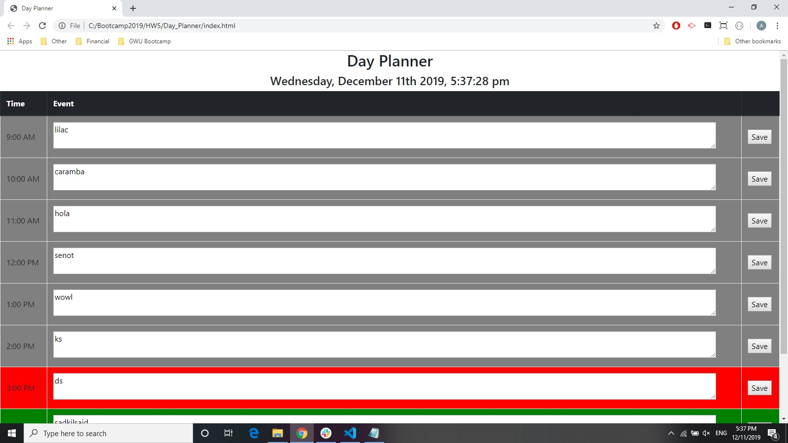

# Day Planner

#### Day_Planner, 12/11/19

#### By Andres Glasener

## Description
Day Planner is a browser based app that alows the user to create a schedule of events for one day, in one hour intervals, as seen below:

## Features

* Users can add events per one hour time slots (9 am - 5 pm)
* User can click save after entering their event informtaion and the data will be saved to their local storage
* Time and Date are dynamically displayed in header of the day planner
* Background color of the time slots change dynamically: grey if it is in the past, red if it is the present time slot, and green if it is in the future

## Setup/Installation Requirements

* Click the link below to access the app: https://aglasener.github.io/Day_Planner/

## Known Bugs

No known bugs at the moment

## Support and contact details

Please email me for further questions at andresglasener@gmail.com.

## Technologies Used

HTML

CSS

Javascript

jQuery

Bootstrap

Moment.js